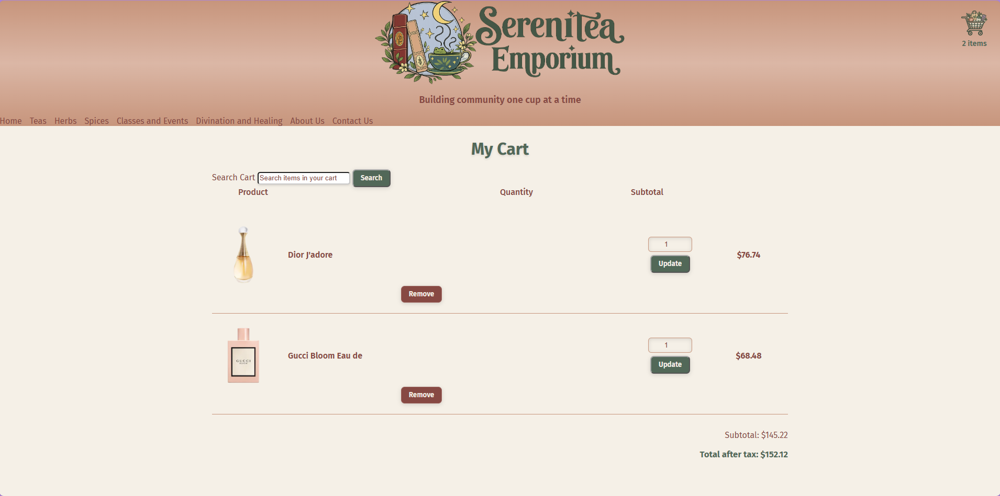

# Serenitea Emporium

Serenitea Emporium is an e-commerce website created with TypeScript, HTML, and CSS. The project simulates an online storefront where users can browse products, add products to a shopping cart, update quantities, remove items, and search their cart.

The website was inspired by Serenitea Emporium, a small tea, herb, and specialty shop in Concord, North Carolina.

## Screenshots

### Storefront


### Shopping Cart



## Features

- Fetches and displays product data from an external API
- Displays product images, descriptions, prices, and discounted prices
- Adds products to a shopping cart
- Stores cart data using `localStorage`
- Tracks and displays the number of items in the cart
- Groups duplicate products and displays their quantities
- Allows users to update product quantities
- Allows users to remove products from the cart
- Searches and filters products within the cart
- Calculates product discounts
- Calculates tax based on product category
- Calculates cart subtotal and total after tax
- Responsive storefront styling
- Custom Serenitea Emporium branding and imagery

## Technologies Used

- HTML5
- CSS3
- TypeScript
- JavaScript
- Vite
- Fetch API
- DOM manipulation
- Local Storage
- Git / GitHub

## Running the Project

Clone the repository and install the project dependencies:

```bash
npm install
```

Start the Vite development server:

    npm run dev

Open the local URL provided by Vite in your browser.

## Project Structure

    src/
    ├── assets/
    ├── models/
    ├── services/
    ├── utils/
    └── main.ts

The project separates product models, API functionality, utility functions, assets, and application logic to keep the code organized.

## Current Development Data

The storefront currently uses sample product data from an external API for development and demonstration purposes. As a result, some displayed products do not represent the actual products sold by Serenitea Emporium.

## Future Improvements

- Replace sample API products with actual Serenitea inventory
- Add product categories for teas, herbs, spices, and specialty items
- Add individual product pages
- Improve responsive/mobile styling
- Add checkout functionality
- Add persistent inventory management
- Improve accessibility

## Author

Priscilla Leonard